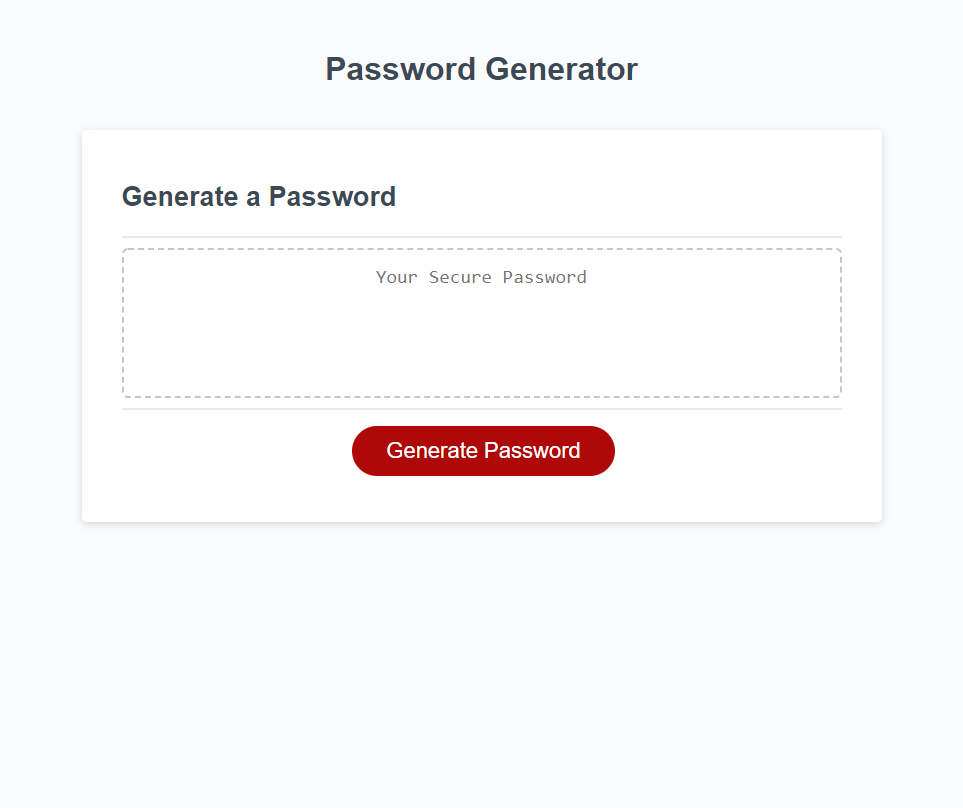

# PasswordGenerator-HW3

This password generator allows the user to generate a new password to their specifications. It promps them with instructions to facilitate this and provides feedback when input is not as expected. In making it I got a chance to become even more familiar with the alert(), confirm(), and prompt() methods as well as general javascript features.

[Site link](https://lroww.github.io/PasswordGenerator-HW3/)
